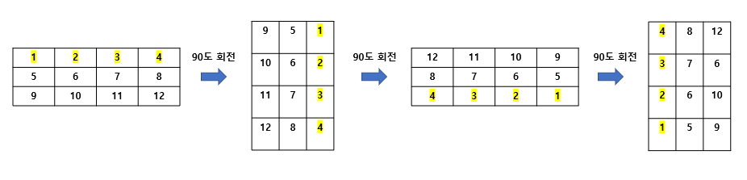

# Python 이차원 리스트 90도씩 회전

아래 그림처럼 이차원 리스트가 90도 씩 회전하는 경우를 구하는 방법



> 일반적인 방법

```python
 import copy

  _list = [[1,2,3], [4,5,6], [7,8,9], [10,11,12]]
  n = len(_list)
  m = len(_list[0])

  result = [[0]* n for _ in range(m)]

  for i in range(n):
      for j in range(m):
          result[j][n-i-1] = _list[i][j]

  _list = copy.deepcopy(result)
  for i in range(len(_list)):
      for j in range(len(_list[i])):
          print(_list[i][j], end=' ')
      print()
```

> zip 함수 사용

```python
 import copy

  _list = [[1,2,3], [4,5,6], [7,8,9], [10,11,12]]
  tmp = []
  for item in zip(*_list): # 꼭 * 이게 들어감
      tmp.append(list(reversed(item)))

  _list = copy.deepcopy(tmp)    

  for i in range(len(_list)):
      for j in range(len(_list[i])):
          print(_list[i][j], end=' ')
      print()

   # 출력 결과 
    10 7 4 1 
    11 8 5 2 
    12 9 6 3
```

